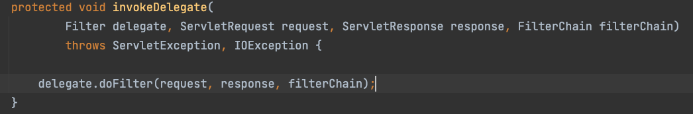
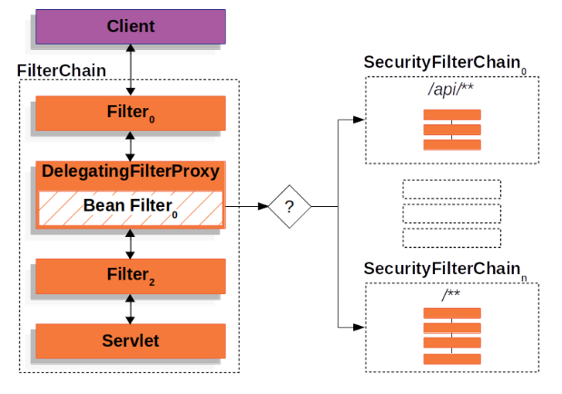

# 스프링 시큐리티
스프링 시큐리티는 필터들의 집합이다. (프록시를 사용한다.) 정확히는 FilterChainProxy
라는 필터를 서블릿 필터에 끼워 넣어준다.

## 구조

spring security는 DelegatingFilterProxy 라는 필터를 만들어 메인 
Filter Chain 에 끼워넣고, 그 아래 다시 SecurityFilterChain 그룹을 
등록한다.

이를 통해 URL 에 따라 적용되는 Filter Chain을 다르게 하는 방법을 사용한다.

여기서 의구심이 드는 것은 spring security 와 was 의 관계이다. 스프링 시큐리티는 
필터의 생명주기를 이용해서 인증과 권한의 작업을 얻는데 서블릿 컨테이너 에서는 스프링 컨테이너
에 등록된 빈을 인식할 수 없기 때문이다.

그로 인하여 나온 것이 DelegatingFilterProxy 이다. 내부적으로 target 즉, spring 컨테이너에
등록된 filterChain을 가지고 인증 인가 작업을 실시하게 된다.

DelegatingFilterProxy 내부에는 FilterChainProxy 라는 것이 있는데, 이것도 스피링 시큐리티에서
제공하는 필터이다. doFilter 에 의한 호출을 스프링 시큐리티 필터체인에 전달하고 작업을 위임하는 역할을 한다.

## 구성요소

### SecurityContextHolder