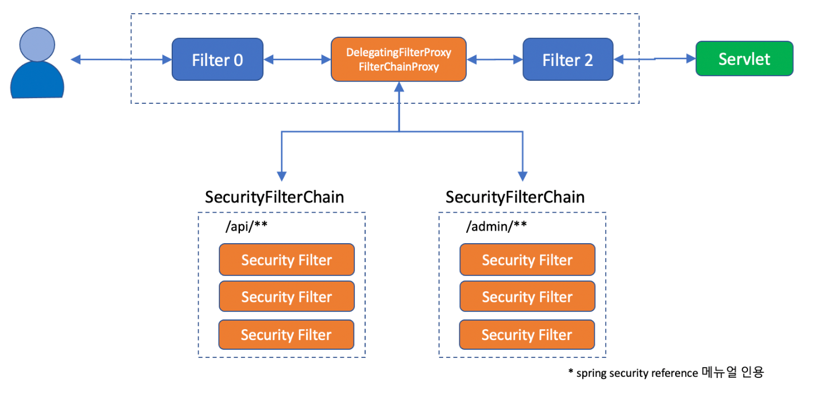

# 스프링 시큐리티
스프링 시큐리티는 필터들의 집합이다. (프록시를 사용한다.) 정확히는 FilterChainProxy
라는 필터를 서블릿 필터에 끼워 넣어준다.

Filter는 최종적으로 dispatcherServlet도 호출하게 되고, Controller 까지
호출 하게 된다.

## 구조

일반적인 Filter 구조

단일 HTTP 요청에 대한 요청 계층 


### 흐름
1. 클라이언트가 앱으로 요청을 보냄

2. 컨테이너(WAS - 서블릿, 필터들을 가지고 있음)는 요청에 대한 URI를 보고 프로 세스를 진행 한다.
    * 단 spring의 경우 대부분의 모든 요청을 하나의 서블릿 즉, DispatcherServlet을 사용한다. 하지만 여러개의 필터 사용가능하다.
   
3. 프로세스 진행은 필터를 거쳐 서블릿으로 가는 흐름이다
    * 필터는 다음과 같은 기능을 가진다.
      * 다음 Filter로 진행하거나 서블릿의 프로세스 진행을 막고 즉각적으로 HttpServletResponse를 작성(반환)
      * HttpServletRequest 혹은 HttpServletResponse 를 가공하는 목적으로 사용되며 해당 객체들은 다음 필터 혹은 서블릿에서 사용된다.

🖥 Filter
```java
public void doFilter(ServletRequest request, ServletResponse response, FilterChain chain) {
	// do something before the rest of the application
    chain.doFilter(request, response); // invoke the rest of the application
    // doFilter 에서 다음 필터가 있으면 필터를 호출하고, 필터가 없으면 서블릿을 호출한다.
    // do something after the rest of the application
}
```

doFilter 이후 부분은 Controller 즉 request Handler 를 거치고 난 후 이다.

### 스프링 부트에서의 서블릿 필터 등록

🖥 서블릿 필터 등록
```java
@Configuration
public class FilterConfiguration {
   /**
    * spring boot 에서는 필터를 빈으로 등록해도 was 에서 필터를 등록한다
    * spring boot 에서 필터를 등록하기 위해서는 FilterRegistrationBean 을 사용해서 등록해야 한다.
    */
   @Bean
   public FilterRegistrationBean filter1() {
      FilterRegistrationBean<Filter> filterRegistrationBean = new FilterRegistrationBean<>();
      filterRegistrationBean.setFilter(new Filter1());
      filterRegistrationBean.setOrder(1);
      filterRegistrationBean.addUrlPatterns("/*");
      return filterRegistrationBean;
   }
}
```

Spring Boot 에서는 Filter 를 ComponentScan을 통해서 WAS에 등록할 수 있다. 
등록하는 방법으로는 총 3가지 방법이 있다.

1. @Component 방식 -> @Order 를 통해 순서 보장, 하지만 url 패턴 매핑 불가
2. @ServletComponentScan + @WebFilter 방식 url 매핑 가능하나 순서 지정 불가 (@Order 가 안먹힘)
3. FilterRegistrationBean

### DelegatingFilterProxy
spring boot 에서 필터를 등록하는 과정에서 bean에는 Filter를 등록하지 않는다는 점이다.
필터를 등록하기 위한 FilterRegistrationBean를 등록하는 것이지 직접 Filter를 빈에 올려놓고 동작하지 않는다는 것을 알 수 있다.


따라서 Spring은 Filter를 스프링빈에 등록하게 될 경우 이 Filter와 WAS를 연결해줄 무언가가 필요 했는데 DelegatingFilterProxy 가 그것이다.


공식 문서를 보게 되면

> Spring은 DelegatingFilterProxy 를 제공하는 데 그것이 WAS 와 Spring Container 의 연결다리 역할을 한다고 나와있다.
> Filter 등록 표준을 사용하여 필터를 등록할 수 있지만 Spring Bean의 Filter는 인식하지 못한다.
> 따라서 DelegatingFilterProxy 를 서블릿 필터로 올려두고 Filter 구현체들을 연결하는 것이다.

따라서 DelegatingFilterProxy 의 수도코드는 다음과 같아진다.

🖥 수도 코드
```java
public void doFilter(ServletRequest request, ServletResponse response, FilterChain chain) {
	// Lazily get Filter that was registered as a Spring Bean
	// For the example in DelegatingFilterProxy
    // delegate is an instance of Bean Filter0
	Filter delegate = getFilterBean(someBeanName);
    // (FilterChainProxy)을 Spring Bean에 작업을 위임한다.
	delegate.doFilter(request, response);
}
```

1. delegate 는 ApplicationContext 의 Bean Filter를 살피고 해당 Filter의 프로세스를 진행하게 된다.
2. delegate 를 통해서 프록시를 활용하여 Filter를 지연로딩 할 수 있다.

### FilterChainProxy
FilterChainProxy 는 SecurityFilterChain 을 사용하기 위해 정의 된 것이다.

SecurityFilter 는 상당히 많은 Filter 들이 Chain 형식으로 묶여 있는데 이의 대리자를 다시 FilterChainProxy 가
수행하게 된다.FilterChainProxy가 빈으로 등록되기 때문에 DelegatingFilterProxy로 다시 감싸지게 된다.


즉 서블릿 기술의 필터를 맞추기 위해 DelegatingFilterProxy를 사용하고
여러개의 SecurityFilter를 관리하기 위해 FilterChainProxy로 Filter집합을
만들었으며 내부적으로는 여러개의 필터들이 엮여있다.




spring security는 DelegatingFilterProxy 라는 필터를 만들어 메인 
Filter Chain 에 끼워넣고, 그 아래 다시 SecurityFilterChain 그룹을 
등록한다.

이를 통해 URL 에 따라 적용되는 Filter Chain을 다르게 하는 방법을 사용한다.

여기서 의구심이 드는 것은 spring security 와 was 의 관계이다. 스프링 시큐리티는 
필터의 생명주기를 이용해서 인증과 권한의 작업을 얻는데 서블릿 컨테이너 에서는 스프링 컨테이너
에 등록된 빈을 인식할 수 없기 때문이다.

그로 인하여 나온 것이 DelegatingFilterProxy 이다. 내부적으로 target 즉, spring 컨테이너에
등록된 filterChain을 가지고 인증 인가 작업을 실시하게 된다.


추가적으로 SecurityFilterChain을 2개를 놓고 request 요청에 따라서 필터를
선택하는 방법또한 존재하는데 그렇게 될경우 SecurityFilterChain을 빈으로 등록하지
않고 Filter하나를 다시 chain 2개에 대해 위임해 요청에 따라서 호출할 체인을 결정
하는 방법 또한 존재한다.


